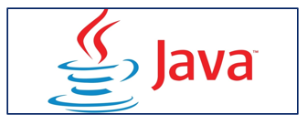
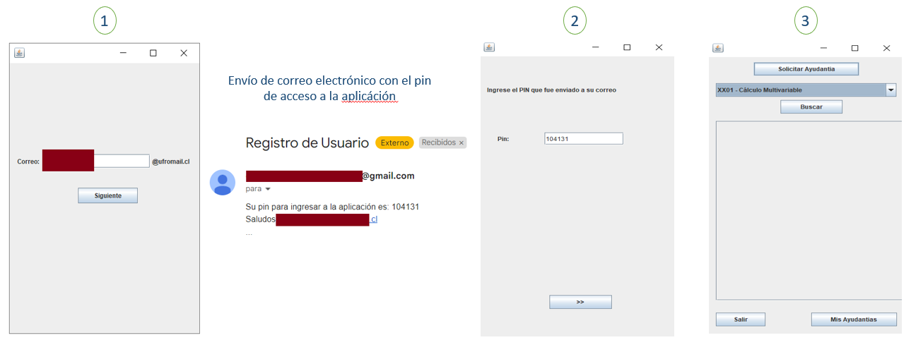
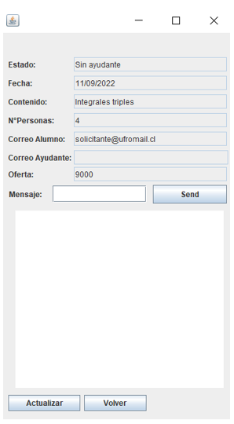
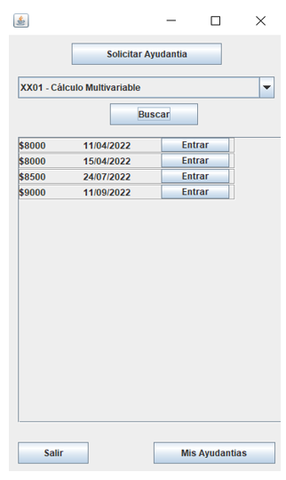
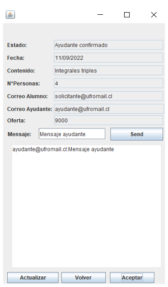

# Proyecto: ```UFRO Ayudas```
El proyecto que se presenta a continuación fue diseñado y creado durante la asignatura ```Programación de sistemas```, ocupando la metodología tradicional iterativa. Su intención es contribuir a la Universidad de La Frontera con una aplicación de escritorio que permita a los estudiantes de la institución registrarse y solicitar ayudantías, así como buscar ayudantías creadas en el servidor para convertirse en el "tutor" de dicha ayudantía. El propósito de la aplicación es permitir que los estudiantes generen ingresos monetarios en función de sus conocimientos, tal y como se detallan en las ayudantías disponibles en la aplicación.
### Tecnología.
<p align="center">
  
</p>
Para llevar a cabo el proyecto, se ocupó principalmente Java, lo que permitió beneficiarse de las ventajas de la programación orientada a objetos y sus características, como la herencia, el polimorfismo y otras más. Entre los paquetes que se ocuparon se encuentran: java.io para manejar archivos FILE que actúan como base de datos de la aplicación, javax.swing para crear la interfaz gráfica de la aplicación y java.net para el envío de solicitudes (objetos de Java) requerido para la comunicación entre el cliente y el servidor a través del protocolo TCP/IP mediante Java Sockets. Además, se emplearon archivos .JAR externos para optimizar el desarrollo de las aplicaciones cliente/servidor.

#### El código fuente completo de la aplicación (tanto del cliente como del servidor) se encuentra reservado. Si algún reclutador está interesado en ver la aplicación en funcionamiento o quiere obtener más información, puede ponerse en contacto conmigo a través del correo electrónico manriquezfernando.ns@gmail.com
A continuación, se presentarán imágenes de la aplicación según los tipos de usuario que pueden existir en la misma, es decir, ayudante o solicitante. Esto se hace para una mayor comprensión de las funcionalidades específicas que se presentan en cada una de ellas.

### ```Registrar cuenta```

<p align="center">
  
</p>

#### Las ilustraciones previas ilustran el procedimiento para crear una cuenta en la aplicación. En primer lugar, se requiere un correo electrónico exclusivo para un determinado dominio institucional. A continuación, se verifica la existencia de una cuenta asociada a ese dominio mediante el envío de un código de acceso. Si el usuario proporciona el código que se le envió por correo electrónico, se le otorga acceso a la aplicación y se le redirige a la página donde puede buscar o solicitar ayudantías.

## Tipo de usuario: ```Solicitante```
### Panel ```Solicitar ayudantía```
<p align="center">
  
</p>

### Panel ```Ayudantía general```
<p align="center">
  
</p>

Las imágenes previas muestran dos paneles distintos pero relacionados con el tipo de cuenta "Solicitante". En el panel "Solicitar ayudantía", el usuario puede especificar la asignatura, contenido, cantidad de participantes y precio ofrecido para la ayudantía que se requiere. En el panel "Ayudantía general", se muestra la ayudantía creada por el usuario. Es importante mencionar que hay un botón que no aparece en la imagen y que está reservado para el correo electrónico del usuario, el cual le permite aceptar la ayudantía y convertirse en el ayudante de su solicitud. Los usuarios que solicitan una ayudantía no pueden convertirse en ayudantes de la ayudantía que solicitan. Además, en el panel "Ayudantía general", cuando una ayudantía no tiene ayudante asignado, su estado aparece como "Sin ayudante".

## Tipo de usuario: ```Ayudante```
### Panel ```Lista ayudantías```
<p align="center">
  
</p>

### Panel ```Ayudantía general```
<p align="center">
  
</p>

En las imágenes anteriores, se presentan dos paneles distintos pero relacionados con el tipo de cuenta "Ayudante". En el panel "Lista de ayudantías", el usuario puede filtrar las ayudantías disponibles en el servidor mediante el código y la asignatura seleccionando la opción disponible que aparece en un ComboBox para encontrar las que le interesan. En el panel "Ayudantía general", se pueden ver los detalles de la ayudantía, incluyendo si ya tiene un ayudante asignado o no. En caso de que no tenga un ayudante, el usuario puede aceptar la ayudantía y su correo electrónico se agregará a la misma.